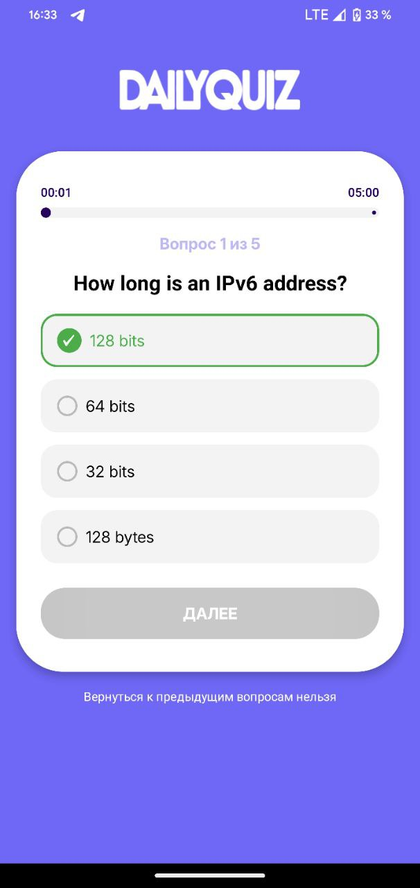
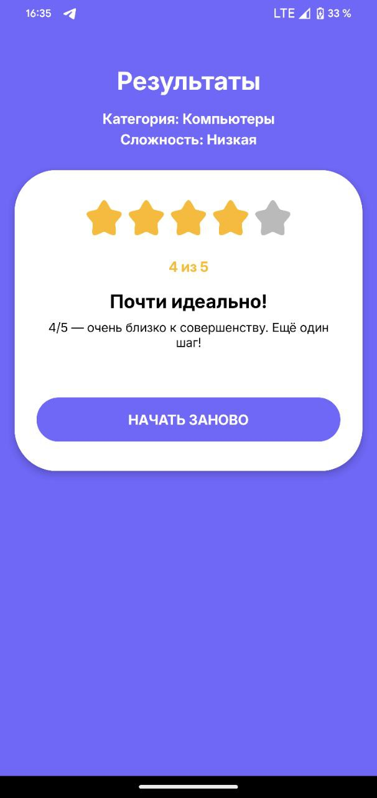
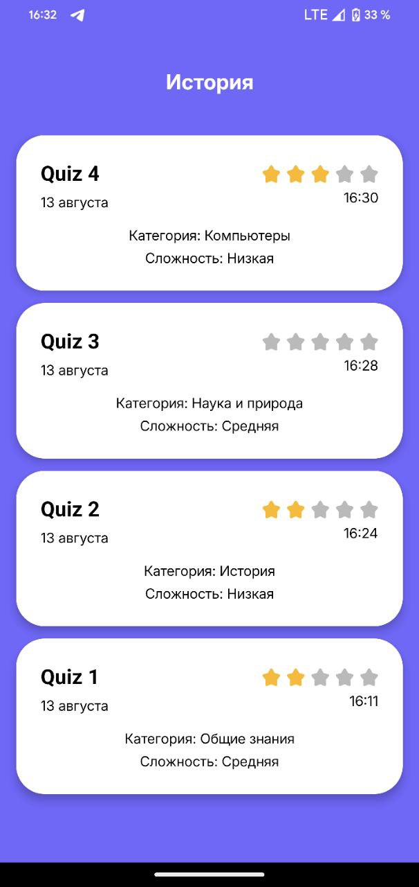
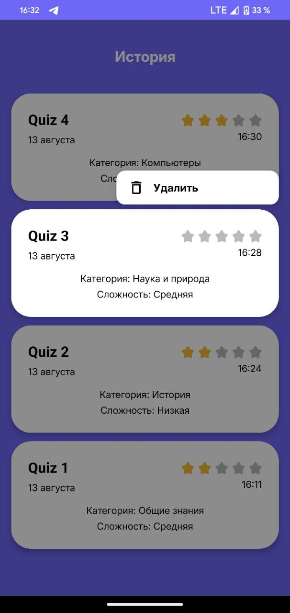

# DailyQuize - приложение для коротких викторин

---

## Описание проекта

**DailyQuize** - лёгкое Android-приложение для коротких пятивопросных викторин.
Запускаешь квиз одним тапом, выбираешь из 4 вариантов на каждый вопрос и сразу видишь итог: звёзды, оценка и мотивационный текст.
Каждая попытка сохраняется в историю с датой и счётом, а лишние записи можно удалить долгим нажатием.
Вопросы берутся из Open Trivia DB,интерфейс построен на Jetpack Compose.

---

## Скриншоты

| Главный экран                       | Ошибка | Фильтрация | Вопросы                             |
|-------------------------------------|---------------|---------------|-------------------------------------|
|  |  |  |         |
| Резултат                            | История | Удаление | Разбор |
|   |  |  |  |

---

## Используемые технологии и библиотеки

| Библиотека               | Назначение                             |
|--------------------------|----------------------------------------|
| Kotlin                   | Язык программирования                  |
| Jetpack Compose          | Современный декларативный UI-фреймворк |
| Navigation Compose       | Навигация между экранами               |
| Hilt                     | Внедрение зависимостей (DI)            |
| Room                     | Локальная база данных                  |
| Retrofit2                | Сетевые запросы                        |
| Moshi                    | JSON-сериализация                      |

---

## Требования к устройству

- Android 7.0 (API 24) и выше

- Доступ в интернет (для онлайн-функционала)

---

## Скачать APK

Собранный `.apk` можно скачать здесь: 

---
